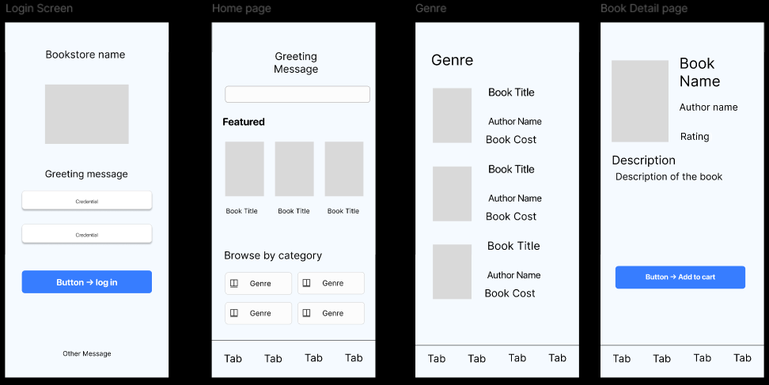
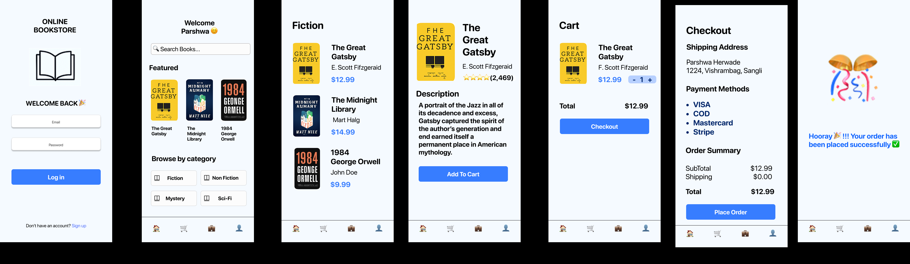
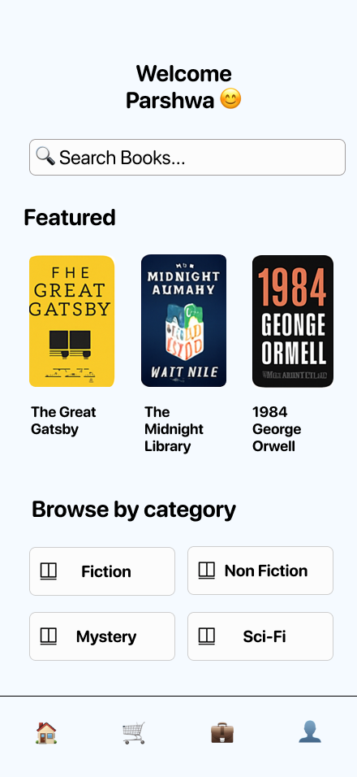
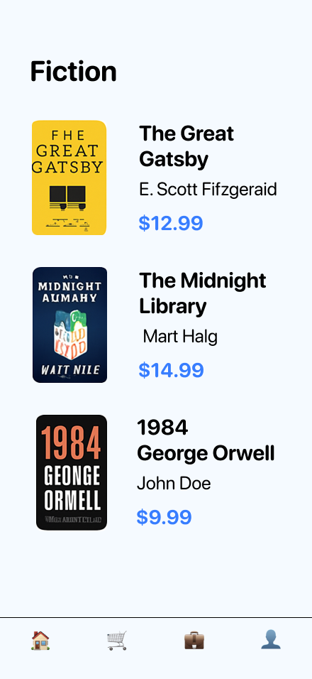
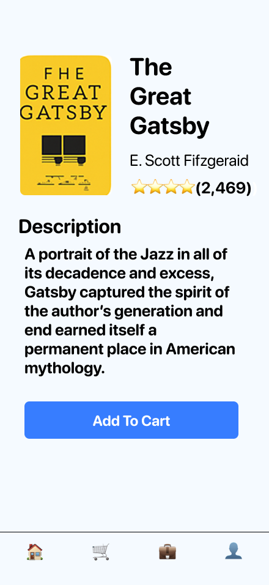
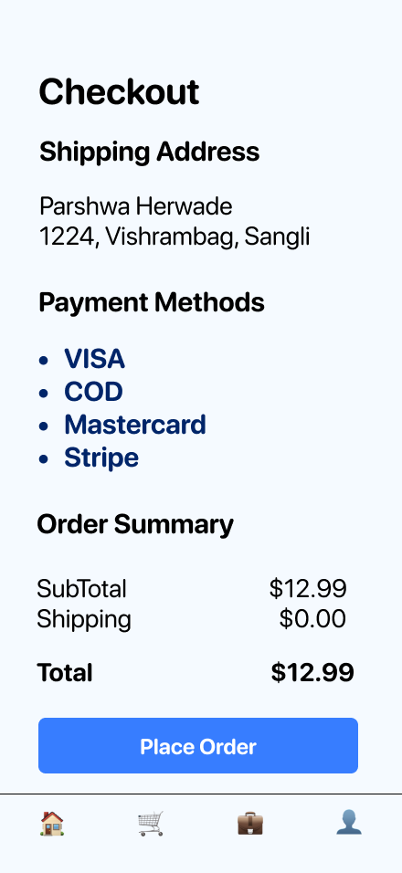
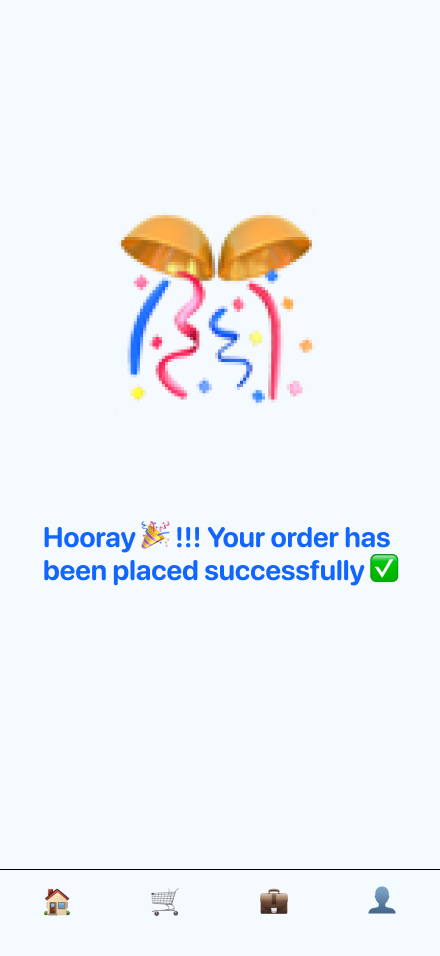

# 📚 Online Bookstore App – Figma Prototype

<div align="center">


**A comprehensive mobile application prototype for an Online Bookstore, showcasing the complete design journey from user research to interactive prototypes.**

[🎨 View Live Prototype](https://www.figma.com/design/fziMoYTwSlNqwkxsAHaUqY/Parshwa-s-Online-Bookstore?node-id=0-1&p=f) • [📱 Screenshots](#-screenshots) • [🔄 Design Process](#-design-process)

</div>

## ✨ Overview

This project demonstrates a complete **user-centered design process** for a mobile Online Bookstore application. Built entirely in Figma, it showcases the evolution from initial user research to polished, interactive prototypes with modern design principles.

### 🎯 Key Highlights
- 📋 **Research-driven design** with user personas and scenarios
- 🖼️ **Low-fidelity wireframes** for structure validation
- 🎨 **High-fidelity prototypes** with full interactivity
- 📱 **Mobile-first approach** with modern iOS design principles
- ♿ **Accessibility-focused** with inclusive design practices
- 🔄 **Iterative improvements** based on usability feedback

---

## 🎯 Project Objectives

- ✅ Apply **user-centered design principles** to mobile app design
- ✅ Document the complete design journey from wireframes to prototypes
- ✅ Create intuitive navigation flows and user experiences
- ✅ Ensure usability, accessibility, and visual consistency
- ✅ Optimize for modern mobile devices and touch interactions

---

## 👥 User Research & Personas

### Primary User Personas

| Persona | Description | Key Needs |
|---------|-------------|-----------|
| **📚 Mike (Student)** | Busy university student | Quick access to textbooks and fiction books |
| **💼 Harvey (Professional)** | Working professional | Fast, clean checkout during short breaks |
| **📖 Louis (Avid Reader)** | Book enthusiast | Browsing across genres with organized categorization |

### 📝 User Stories & Scenarios

#### Core User Stories
- **As a student**, I want to search by category to find books quickly
- **As a professional**, I want to complete checkout in under 2 minutes
- **As an avid reader**, I want to see visible prices, ratings, and detailed descriptions

#### Real-world Scenarios
1. **Mike** logs in → searches for "Python Programming" → adds to cart → pays via UPI
2. **Harvey** browses Featured books → selects a novel → orders via Cash on Delivery
3. **Louis** filters by "Computer Science" → finds textbook → saves to wishlist for later

---

## 🔑 Features & Functionality

### ✅ Functional Features
- 🔐 **Authentication**: Secure login & signup system
- 🔍 **Search & Browse**: Smart search with category filtering
- 📖 **Book Details**: Comprehensive book information (cover, author, price, rating, description)
- 🛒 **Cart Management**: Add, remove, and modify cart items
- 💳 **Multi-payment Checkout**: VISA, Mastercard, Stripe, Cash on Delivery
- 📱 **Responsive Design**: Optimized for touch interactions

### ⚡ Non-Functional Highlights
- ⏱️ **Performance**: Loads in under 3 seconds
- 📱 **Device Compatibility**: Optimized for iPhone 14 Pro, 15 Pro, and 16 Pro Max (440 × 956 px)
- 🔒 **Security**: Secure payment processing and user data protection
- 🎨 **Visual Design**: Clean typography with SF Pro Rounded font
- ♿ **Accessibility**: High contrast UI with touch-friendly elements (minimum 44px tap targets)

---

## 🖼️ Screenshots

### 🔗 Wireframes
<div align="center">

<p><em>Low-fidelity wireframes showing the basic structure and user flow</em></p>
</div>

### 🎨 High-Fidelity Prototype
<div align="center">

<p><em>Complete high-fidelity prototype with visual design and interactions</em></p>
</div>

### 📱 Individual Screens

#### Authentication & Onboarding


*Clean, minimal login interface with social authentication options*

#### Core App Screens
<table>
<tr>
<td></td>
<td></td>
<td></td>
</tr>
<tr>
<td align="center"><strong>Home Page</strong><br>Featured books & categories</td>
<td align="center"><strong>Genre Page</strong><br>Book grid with filtering</td>
<td align="center"><strong>Book Details</strong><br>Complete book information</td>
</tr>
</table>

#### Shopping Experience
<table>
<tr>
<td></td>
<td></td>
<td></td>
</tr>
<tr>
<td align="center"><strong>Shopping Cart</strong><br>Item management & totals</td>
<td align="center"><strong>Checkout</strong><br>Multiple payment options</td>
<td align="center"><strong>Order Success</strong><br>Confirmation & tracking</td>
</tr>
</table>

---

## 🔄 Design Process

### Phase 1: Research & Planning 📋
- **User Research**: Conducted interviews and surveys with potential users
- **Persona Development**: Created detailed user personas based on research findings
- **Information Architecture**: Mapped out content structure and navigation flows
- **Competitive Analysis**: Studied existing bookstore apps for best practices

### Phase 2: Low-Fidelity Wireframes 🖼️
- **Structure Planning**: Established basic layout and content hierarchy
- **User Flow Validation**: Tested navigation paths with stakeholders
- **Content Strategy**: Defined information requirements for each screen
- **Rapid Iteration**: Quick modifications based on initial feedback

**Key Wireframe Elements:**
- Login Screen: Simple form with clear call-to-action
- Home Screen: Search bar + category navigation + featured section
- Genre Screen: Grid layout optimized for book browsing
- Book Details: Information hierarchy with prominent "Add to Cart" button
- Cart Screen: Clear item list with quantity controls and pricing
- Checkout Screen: Streamlined payment method selection

### Phase 3: High-Fidelity Prototypes 🎨
- **Visual Design System**: Developed consistent colors, typography, and spacing
- **Interactive Prototyping**: Added micro-interactions and transitions
- **Brand Identity**: Applied cohesive visual language throughout
- **Responsive Design**: Ensured optimal display across device orientations

**Design Evolution:**
- **Login**: From gray boxes → polished form with branding and social login
- **Home**: From placeholders → dynamic grid with real book covers and search
- **Book Details**: From dummy blocks → rich media with ratings, reviews, and recommendations
- **Checkout**: From generic boxes → branded payment options with security badges

### Phase 4: Usability Testing & Iteration 🔧
- **User Testing**: Conducted moderated usability sessions
- **Feedback Integration**: Implemented improvements based on user insights
- **Accessibility Audit**: Ensured compliance with WCAG guidelines
- **Performance Optimization**: Refined interactions for smooth user experience

**Key Improvements:**
- 📍 Raised "Add to Cart" button position for thumb accessibility
- 🔍 Enlarged book thumbnails for better browsing experience
- 🎯 Improved visual hierarchy for better content scanning
- ⚡ Streamlined checkout flow to reduce abandonment

---

## 🧩 Usability & Accessibility

### Design Principles Applied
- **Consistency**: Uniform buttons, navigation, and interaction patterns
- **Feedback**: Clear confirmations and error states
- **Visibility**: Important information always accessible
- **Efficiency**: Minimal steps to complete key tasks

### Accessibility Features
- ♿ **High Contrast**: Ensures readability for visually impaired users
- 👆 **Touch Targets**: Minimum 44px tap areas for easy interaction
- 🔤 **Typography**: Readable font sizes (minimum 16px body text)
- 🎨 **Color Independence**: Information conveyed through multiple visual cues
- 📱 **Screen Reader Support**: Semantic structure for assistive technologies

### Performance Considerations
- ⚡ **Loading States**: Skeleton screens for better perceived performance
- 🔄 **Offline Support**: Cached content for poor connectivity scenarios
- 📊 **Data Efficiency**: Optimized image loading and content delivery

---

## 📱 Technical Specifications

### Device Optimization
- **Primary Target**: iPhone Pro Max series (440 × 956 px)
- **Secondary Targets**: iPhone 14 Pro, iPhone 15 Pro
- **Orientation**: Portrait-first with landscape considerations
- **Interaction**: Touch-optimized with gesture support

### Design System
- **Colors**: 
  - Primary: #377DFF (Custom Blue)
  - Background: #FFFFFF (Pure White)
  - Gray: #D9D9D9 (Light Gray)
  - Text: #000000
- **Typography**: SF Pro Rounded (iOS native font)
- **Spacing**: 8px grid system for consistent layouts
- **Icons**: SF Symbols for native iOS feel

---

## 📂 Repository Structure

```
📦 Online-Bookstore-Figma-Prototype/
├── 📁 assets/
│   ├── 📁 wireframes/          # Low-fidelity wireframe screenshots
│   │   └── low-fidelity-wireframe.png
│   ├── 📁 prototype/           # High-fidelity prototype overview
│   │   └── high-fidelity-wireframe.png
│   └── 📁 screens/             # Individual screen screenshots
│       ├── login-screen.png
│       ├── home-page.png
│       ├── genre-page.png
│       ├── book-detail-page.png
│       ├── cart-page.png
│       ├── checkout-page.png
│       └── order-confirmation-page.png
└── 📄 README.md               # This documentation
```

---

## 🚀 Key Learnings & Reflection

### Design Process Insights
- **User-Centered Approach**: Starting with user research dramatically improved design decisions
- **Iterative Design**: Regular feedback loops prevented major redesigns later
- **Mobile-First**: Designing for mobile constraints led to cleaner, more focused interfaces
- **Accessibility**: Inclusive design benefits all users, not just those with disabilities

### Technical Insights
- **Figma Prototyping**: Advanced component systems and auto-layout improved consistency
- **Design Systems**: Establishing patterns early accelerated the design process
- **User Testing**: Real user feedback revealed assumptions about navigation preferences

### Future Enhancements
- 🔖 **Wishlist Functionality**: Save books for later purchase
- 🔍 **Advanced Filtering**: Sort by price, rating, publication date
- 🤖 **Personalized Recommendations**: AI-driven book suggestions
- 📚 **Reading Progress**: Track reading status for purchased ebooks
- 💬 **Social Features**: Reviews, ratings, and reading communities
- 🌙 **Dark Mode**: Alternative theme for different lighting conditions

---

## 🛠️ Tools & Technologies

<div align="center">


</div>

- **Primary Design**: Figma (Prototyping, Design System, Collaboration)
- **User Testing**: Figma's built-in sharing and feedback tools
- **Documentation**: Markdown, GitHub

---

## 🤝 Contributing

This project serves as a design case study and educational resource. If you'd like to suggest improvements or have feedback:

1. 🍴 Fork the repository
2. 🌟 Star it if you find it helpful
3. 💬 Open an issue for discussions
4. 📧 Contact for collaboration opportunities

---

##  Inspiration

> *"Design is not just what it looks like and feels like. Design is how it works."*  
> — **Steve Jobs**

This project embodies the principle that great design seamlessly blends aesthetics with functionality, creating experiences that are both beautiful and intuitive.

---

<div align="center">

### 🌟 If this project helped you learn something new, please give it a star!

**Made with ❤️ and lots of ☕ by Parshwa**

</div>
